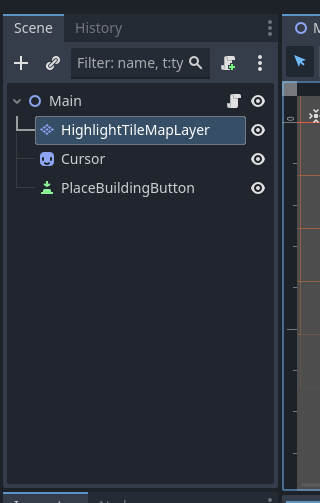
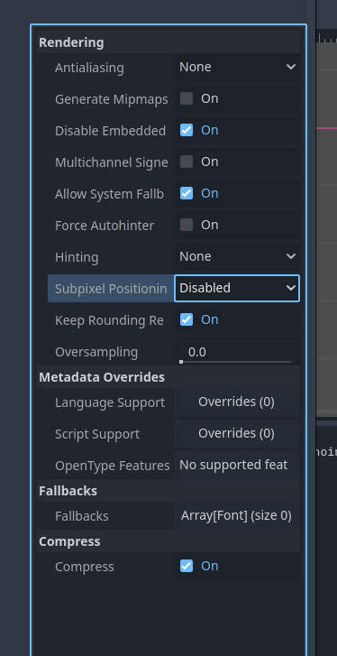

# Notes for future game dev

- In case of pixelated game dev, change godot settings in window to   
	--> settings --> display --> window --> Stretch --> viewport  
	it helps when rescaling the canvas so that pixel graphics are stretched with it, without altering resolution/ texture of pixel graphics

- the order in which the resources appear in the scene, are the order in which Godot draws them on the canvas, starting from top to bottom (works even for nested resources). This means, resource that is on top of the rest has to be in lowest position

  

- A **HashSet** is a data structure wherein each elemetn of the HashSet is going to be unique (for example Vector2)... If one adds same HashSet ( for example one occupied set as a Vector2) it won't add a same one if it included again 

- Switching e.g. Main Node (where we would add all level resources) from Node2D (which has positional arguments) to a simple Node type, helps to avoid the accidental movement of the whole level positioning. Main is so used as common ancestor for each child nodes, therefore it deosn't need positional data

- Lesson 13: we created a scene for the Grid Manager, which will be used to handle grid related stuff. This is a safer way of coding, when it comes to figuring out the structure of the scene. When we use the GridManager we do not know exactly the Node pathe to the HiglightTileMap Layer, so creating a fixed reference to it, using a GridManager scene, avoids problems with unknown paths

- Group is a string value to a key that can be assigned to any number of nodes. Favorable is that the node can then be used from any node without knowing the node path

- Helper functionality for iterating over collection of data.

- .CallDeferred(): is a method that can be called in a deferred function --> it says, call this function after all other GoDot processes are done for this frame. Nice way of saying do this at the end without reorganizing code. Guarantees that game state is all up to date before that deferred method call is made.
For example to use to update all building positions before storing where the new positions are for the next code iteration

- nice way to iterate over a node component  
var occupiedTiles = buildingComponents.Select(x => x.GetGridCellPosition());  
foreach ( var existingBuildingComponent in buildingComponents) 
-->  calls function on component x using the GetGridCellPosition method and iterates over all of the different x(components) and returns, in this case the location of all the placed buildings.

- custom resources creates a text file where we can use to save some configurable data. Good practice especially when storing data on a Node directly causes trouble. We can e.g. create a Resource that contains the resourceComponent "buildable radius" that we can Instantiate when needed

- square root calcutaions are CPU intensive and should be avoided if possible

- **Font Sizing**: When apllying Font type and importing it to GoDot, when using pixel fonts change the fonts setting to the following. This ensures criper letters: 

- Careful when copying or duplicating in GoDot as it creates a shared reference to the copied object. To remove this reference, one then has to select the "Make unique" option